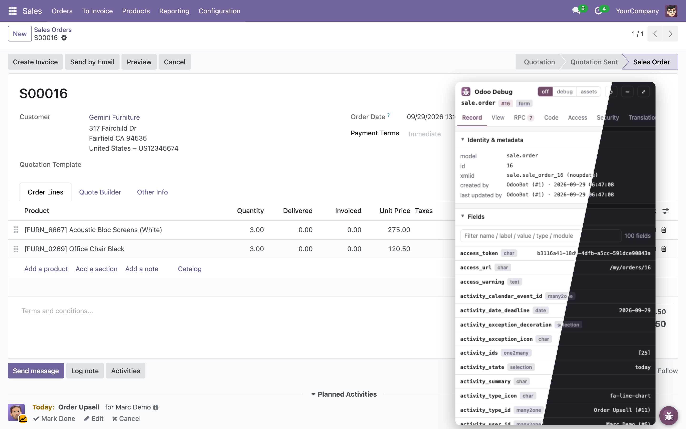
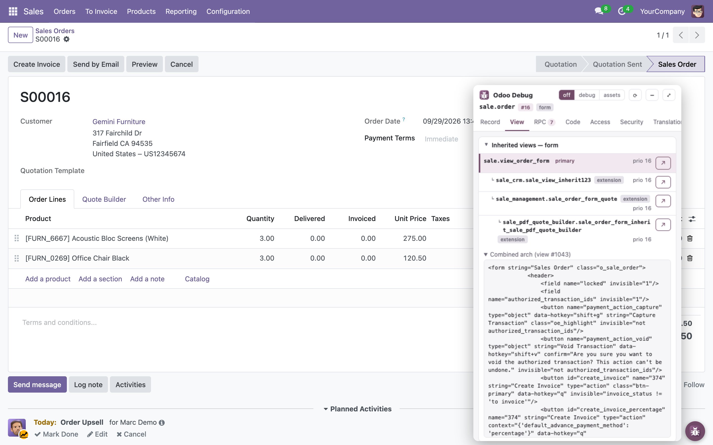
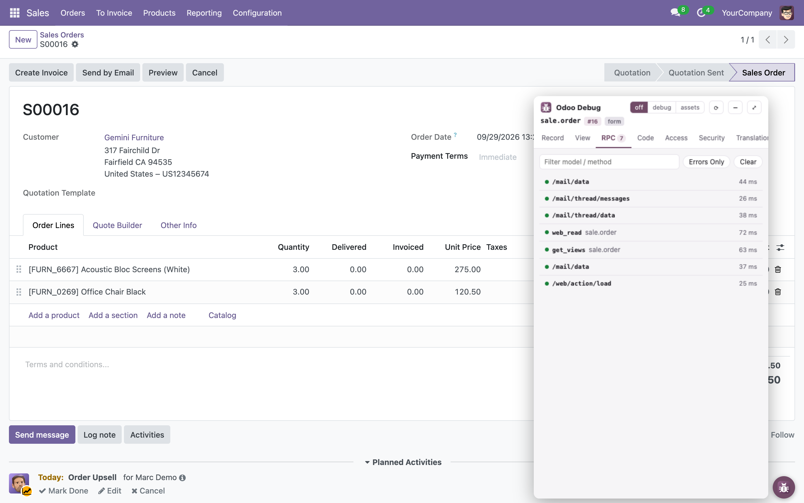
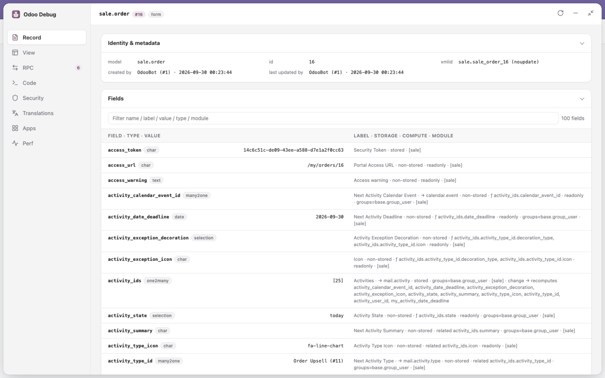
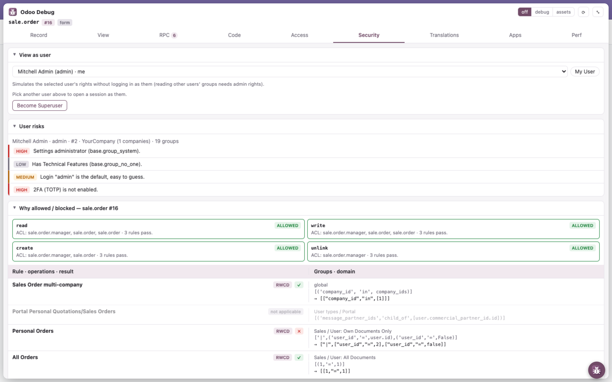
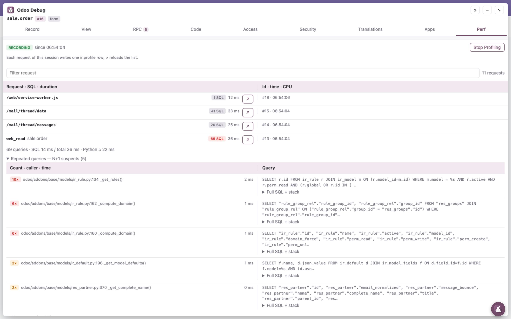
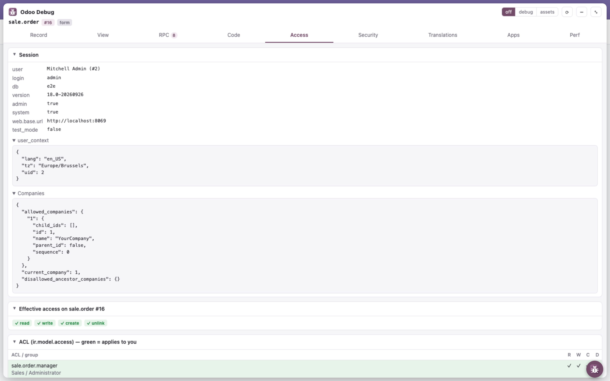
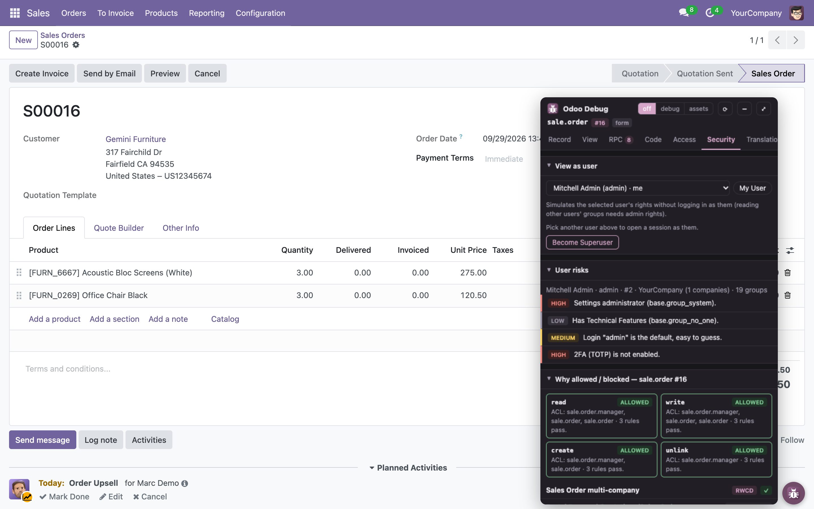

<div align="center">


# Odoo Debug

**Bảng debug ngay trên trang dành cho lập trình viên Odoo.**<br>
Soi record, view, lời gọi RPC, quyền truy cập và hiệu năng server mà không phải rời trang đang debug.

[](https://github.com/unclecatvn/extension-debug-odoo/releases)
[](https://github.com/unclecatvn/extension-debug-odoo/actions/workflows/release.yml)
[](https://github.com/unclecatvn/extension-debug-odoo)


[English](README.md) · **Tiếng Việt**

[Website](https://unclecatvn.github.io/extension-debug-odoo/) · [Cài đặt](#cài-đặt) · [Tính năng](#tính-năng) · [Sử dụng](#sử-dụng) · [Quyền riêng tư](#quyền-riêng-tư--quyền-hạn) · [Phát triển](#phát-triển) · [Changelog](CHANGELOG.md)



</div>

## Vì sao cần Odoo Debug

Chế độ developer có sẵn của Odoo cho bạn biết trên màn hình *có gì*. Odoo Debug cho bạn biết *vì sao*: module nào thêm field này, view kế thừa nào đã sửa form, lời gọi RPC nào lỗi và traceback ra sao, record rule nào chặn một user, request nào bắn ra 50 câu SQL. Tất cả nằm trong một bảng kéo thả được ngay trên trang Odoo, cô lập trong shadow DOM nên không bao giờ đụng tới CSS của Odoo.

## Tính năng

| Tab | Bạn nhận được gì |
|---|---|
| **Record** | Định danh & metadata (xmlid, `noupdate`, người tạo / sửa), mọi field kèm kiểu, giá trị, module, cách lưu, nguồn compute / related, `groups=` và các field mà nó kích hoạt tính lại. |
| **View** | Cây kế thừa của view hiện tại (primary + extension, priority, file nguồn), arch đã gộp, thông tin action, modifier của field trên form (`invisible` / `readonly` / `required`) tính đúng như webclient, *Chọn trên trang*. |
| **RPC** | Nhật ký trực tiếp các lời gọi JSON-RPC và JSON-2 từ lúc tải trang: thời gian, lỗi kèm traceback, và nút nhảy sang tab Security khi gặp `AccessError`. |
| **Access** | Phiên làm việc (db, version, `web.base.url`, `test_mode`), quyền thực tế, ACL, record rule, nhóm, tham số hệ thống (giá trị bí mật được che) và các module đã cài. |
| **Apps** | Với danh sách module cách nhau bởi `;`: Activate (Update Apps List rồi cài kèm dependency), Upgrade, Open Forms (cần quyền Settings). |
| **Security** | Giả lập quyền của user khác, giải thích từng rule vì sao một thao tác được phép hay bị chặn, đánh giá rủi ro của user, field bị ẩn bởi `groups=`, kiểm tra instance (HTTPS, cờ cookie, security header, database manager). **Switch to This User** mở cửa sổ ẩn danh tại trang đăng nhập của user đó, không đụng tới phiên của bạn (có OCA `impersonate_login`: impersonate ngay trong phiên này). |
| **Translations** | Xuất file mẫu `.pot` và một `.po` cho mỗi ngôn ngữ của nhiều app bằng wizard có sẵn của Odoo, lưu thẳng vào `Downloads/<module>/i18n/`. |
| **Perf** | Profiler có sẵn của Odoo: bật / tắt, danh sách request đã đo, tổng hợp SQL với các câu lặp lại (nghi N+1), câu chậm nhất, flame graph speedscope. |

Ngoài ra: bấm vào tên field, model hay xmlid trong bảng để copy, và <kbd>⌥ Alt</kbd> + click vào một field trên trang Odoo để copy tên kỹ thuật của nó.

### Ảnh chụp màn hình

<table>
  <tr>
    <td width="50%"><b>View</b>: cây kế thừa và arch đã gộp<br></td>
    <td width="50%"><b>RPC</b>: mọi lời gọi kèm thời gian<br></td>
  </tr>
</table>

**Record** ở chế độ toàn màn hình: từ 760px trở lên, danh sách thành bảng 2 cột với tiêu đề cố định.


**Security**: vì sao một thao tác được phép hay bị chặn, từng rule một, kèm rủi ro của user.


**Perf**: các request đã đo, với câu SQL nghi N+1 và các câu chậm nhất của từng request.


<table>
  <tr>
    <td width="50%"><b>Access</b>: phiên, quyền, ACL<br></td>
    <td width="50%"><b>Giao diện tối</b><br></td>
  </tr>
</table>

## Cài đặt

Extension chưa có trên Chrome Web Store; cài dạng unpacked (Chrome, Edge, Brave và các trình duyệt nhân Chromium):

1. Tải `odoo-debug-v<version>.zip` từ [Releases](https://github.com/unclecatvn/extension-debug-odoo/releases) rồi giải nén (hoặc `git clone https://github.com/unclecatvn/extension-debug-odoo.git`).
2. Mở `chrome://extensions` và bật **Developer mode**.
3. Bấm **Load unpacked** và chọn thư mục vừa giải nén (nếu clone: chọn thư mục `extension/`).
4. Mở một trang Odoo bất kỳ: nút tròn xuất hiện ở mép dưới.

## Sử dụng

- **Mở / đóng**: bấm nút tròn; bảng mở ở mép dưới, đúng tab và vị trí cuộn lần trước. Kéo nút đi đâu cũng được; vị trí được nhớ riêng cho từng instance Odoo (thả lại gần mép dưới thì nút bám lại mép). Trên các trang không phải Odoo thì không có gì hiện ra, và icon trên thanh công cụ bị làm mờ.
- **Toàn màn hình**: <kbd>⤢</kbd> trên thanh tiêu đề của bảng, <kbd>Esc</kbd> hoặc <kbd>⤡</kbd> để thoát. Trạng thái mở và toàn màn hình được giữ khi tải lại trang.
- **Chế độ debug**: công tắc `off` / `debug` / `assets` trên thanh tiêu đề tải lại Odoo ở chế độ tương ứng.
- **Thẻ**: mỗi tab là một chồng thẻ, ban đầu đều đóng; thẻ chỉ tải dữ liệu khi được mở, và trạng thái mở / đóng được giữ qua các lần tải lại. Bấm vào một dòng trong list để xem chi tiết (nhãn, cách lưu, module, giá trị đầy đủ…), bấm lần nữa để đóng.
- **Copy**: bấm vào tên field, model, xmlid hay tham số trong bảng; <kbd>⌥ Alt</kbd> + click vào field, nhãn, ô trong list hoặc tiêu đề cột trên trang. Giá trị bí mật bị che vẫn copy ra giá trị thật.
- **Tải lại dữ liệu**: <kbd>⟳</kbd>. Dữ liệu ổn định của server (session info, `fields_get`, danh sách user) được cache tới khi tải lại trang; ACL, rule, view và giá trị record luôn được đọc lại.
- **Cài đặt**: bấm icon trên thanh công cụ (hoặc chuột phải → *Options*): ngôn ngữ (English, Tiếng Việt), giao diện (theo hệ thống / sáng / tối), hiện / ẩn bảng.

### Tương thích

| | Hỗ trợ |
|---|---|
| Odoo | 18.0, 19.0 |
| Trình duyệt | Chrome và các trình duyệt nhân Chromium (Manifest V3) |
| Ngôn ngữ | English, Tiếng Việt |

Một bản build chạy cho mọi phiên bản: khác biệt được phát hiện lúc chạy (field / route có tồn tại không?), không bao giờ so số phiên bản. Xem [Các phiên bản Odoo](#các-phiên-bản-odoo).

## Quyền riêng tư & quyền hạn

Odoo Debug chỉ nói chuyện với server Odoo của tab bạn đang mở, bằng chính phiên đăng nhập của bạn. Không có backend, không có analytics, không gửi gì đi nơi khác.

| Quyền | Để làm gì |
|---|---|
| `host_permissions: <all_urls>` | Odoo chạy trên bất kỳ tên miền nào; bảng chỉ bật trên những trang được nhận diện là Odoo. |
| `scripting` | Đọc trạng thái webclient (record, view, action hiện tại) từ trang. |
| `cookies` | Báo các cờ của cookie phiên (`Secure`, `HttpOnly`, `SameSite`) trong tab Security. Giá trị cookie không bao giờ bị đọc. |
| `storage` | Lưu cài đặt ngôn ngữ và giao diện. |
| `clipboardWrite` | Copy tên field, xmlid và giá trị. |
| `downloads` | Lưu file `.pot` / `.po` đã xuất vào `Downloads/<module>/i18n/` (tab Translations). |
| `declarativeContent` | Chỉ bật icon trên thanh công cụ ở trang Odoo. |

Dữ liệu Odoo chỉ được đưa vào DOM qua `textContent`, và trang khác không thể nhúng (frame) bảng debug. `odoo.conf` không bao giờ truy cập được từ trình duyệt (Odoo không công khai nó), và extension cũng không thử.

## Phát triển

Không có bước build, không có dependency: sửa code rồi reload extension trong `chrome://extensions`.

```bash
npm test
```

```bash
npm run i18n
```

`npm test` chạy mọi `tests/*.test.mjs` bằng test runner có sẵn của Node; `npm run i18n` trích chuỗi ra `extension/i18n/odoo_debug.pot` và gộp vào mọi file `.po`.

### Cấu trúc dự án

```
extension/                 chính extension: đúng những gì có trong file zip release (Load unpacked thư mục này)
  manifest.json
  icons/                   icon của extension (make-icons.sh)
  i18n/                    odoo_debug.pot + en.po, vi.po (đọc lúc chạy, không cần build)
  src/
    background.js          chỉ bật icon trên trang Odoo (declarativeContent)
    popup/                 popup trên thanh công cụ = trang options: ngôn ngữ, giao diện, hiện/ẩn bảng
    content/               hook.js (MAIN world, ghi lại JSON-RPC), relay.js (chuyển tiếp tới bảng),
                           bubble.js (nút kéo thả + iframe của bảng trong shadow root, copy bằng ⌥/Alt+click)
    panel/                 panel.html / panel.css / main.js: thanh tiêu đề, các tab, gắn với tab đang nhúng
    shared/                ui.js (DOM, RPC, đọc có cache), page.js (hàm lõi chạy trong trang), i18n.js, odoo.js, settings.js
    features/<tab>/        mỗi tab một thư mục: record, view, rpc, access, security, translations, apps, perf
      <tab>.js             giao diện tab: render(section, state)
      page.js              hàm được inject vào trang Odoo (tự chứa, không import)
      logic.js             logic thuần, không chrome.* / DOM
website/                   trang giới thiệu (GitHub Pages); screenshots/ dùng chung với README
tests/                     *.test.mjs, mỗi module logic một file
tools/i18n.mjs             npm run i18n: trích chuỗi → .pot, gộp vào mọi .po
```

Các đường dẫn bên dưới tính từ `extension/`.

### Quy ước

- Mọi chuỗi người dùng nhìn thấy đều đi qua `_t('English text %s', value)` (hoặc `N_('…')` ở chỗ `_t` không chạy được, ví dụ hàm chạy trong trang); HTML tĩnh dùng `data-i18n`. Chạy `npm run i18n` rồi dịch các mục mới trong `i18n/vi.po`.
- Dữ liệu ổn định của server đi qua `cached()` trong `shared/ui.js`; thứ gì có thể đổi trong lúc debug thì luôn đọc lại.

### Các phiên bản Odoo

Không có code riêng cho từng phiên bản. Để hỗ trợ phiên bản khác, kiểm tra các chỗ sau và thêm fallback cạnh fallback sẵn có:

| Điểm khác biệt | Ở đâu |
|---|---|
| Field nhóm của `res.users` (`groups_id` → `group_ids` / `all_group_ids` ở bản 19) | `shared/odoo.js` `pickGroupField` |
| JSON-2 API `/json/2/<model>/<method>` (19) | `content/hook.js`, `features/rpc/logic.js` |
| `ir.profile.cpu_duration` (19), wizard profiling | `features/perf/perf.js` |
| Bên trong webclient: action service `__WOWL_DEBUG__`, `currentState`, `odoo.loader` + `py_js`, `archInfo` của form | `shared/page.js`, `features/view/page.js`, `features/security/page.js` |
| URL `/odoo/…` (bản cũ: `/web#…`) | fallback trong `shared/page.js` |
| Method phía server: `has_access`, `res.users.has_groups`, `get_metadata`, `get_views`, `/web/become` | `features/access`, `features/security`, `features/record`, `features/view` |

Fallback thuần đặt trong `shared/odoo.js` (test ở `tests/odoo.test.mjs` tại thư mục gốc repo). Hàm chạy trong trang không import được nên fallback của chúng viết inline. Khi một chỗ vượt quá vài nhánh, đó mới là lúc thêm adapter, không sớm hơn.

### Phát hành

Tăng `version` trong `extension/manifest.json`, thêm section tương ứng vào [CHANGELOG.md](CHANGELOG.md) rồi push lên `main`: CI tạo tag `v<version>` và đăng file zip với section đó làm release notes. Mỗi gạch đầu dòng trong CHANGELOG viết trên một dòng: release notes của GitHub coi mỗi lần xuống dòng là ngắt dòng thật.

## Đóng góp

Rất hoan nghênh issue và pull request. Trước khi mở PR:

1. `npm test` chạy qua và `npm run i18n` không làm thay đổi `extension/i18n/` (CI kiểm tra cả hai).
2. Chuỗi mới đã được dịch trong `extension/i18n/vi.po`.
3. Đã thử trên ít nhất một instance Odoo; ghi rõ phiên bản trong PR.

Gặp lỗi? [Mở issue](https://github.com/unclecatvn/extension-debug-odoo/issues) kèm phiên bản Odoo, trang bạn đang mở và, nếu có, lỗi trong tab RPC.

## Ủng hộ dự án

Nếu Odoo Debug giúp bạn tiết kiệm thời gian, hãy ⭐ [star trên GitHub](https://github.com/unclecatvn/extension-debug-odoo): nó giúp các lập trình viên Odoo khác tìm thấy dự án.

## Tác giả

Phát triển bởi **UncleCat** · [unclecatvn.com](https://unclecatvn.com/)
